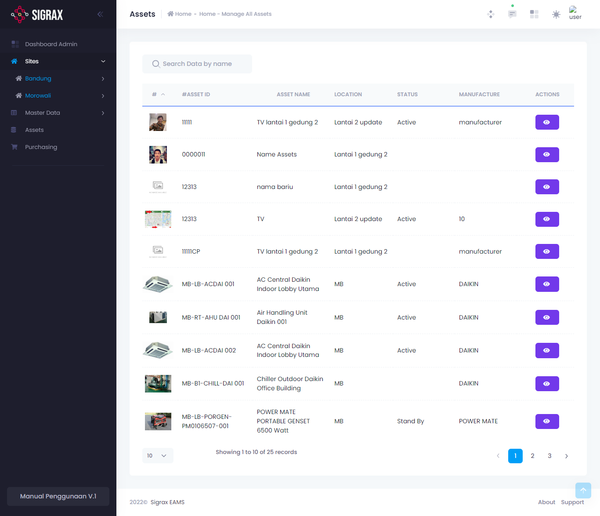

Halaman assets atau master assets adalah halaman untuk melihat keseluruhan aset yang anda punya. Tampilan dari halaman asset ini sendiri adalah sebagai berikut.

!!!
Perlu diingat bahwa halaman master asset ini berfungsi untuk melihat keseluruhan aset anda saja. Untuk menambahkan aset, anda dapat melakukannya di dalam setiap site atau lokasi anda. Untuk lebih lanjut, anda dapat melihat modul **[Site Asset](sites/site-assets/)**.
!!!

Anda dapat melihat detail aset dengan menekan tombol berlogo mata yang berada di samping tiap aset. Setelah anda menekan tombol tersebut, anda akan dibawa ke halaman detail aset tersebut, yang juga sama pada detail aset yang terdapat pada modul **[Site Asset](sites/site-assets/)**.
