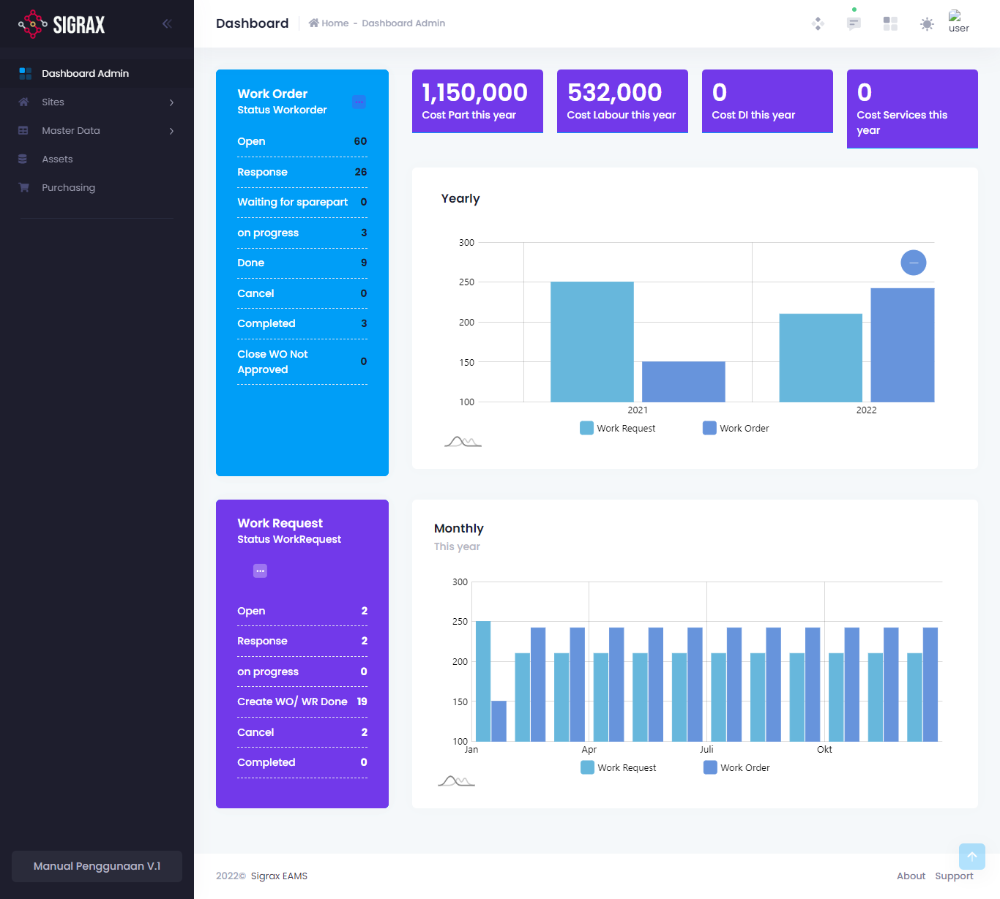

# Dashboard Admin

Dashboard admin adalah modul untuk melihat *highlight* keseluruhan pekerjaan yang terjadi pada perusahaan dan juga biaya yang telah dikeluarkan. Dashboard admin ini juga merupakan modul yang pertama kali anda lihat setelah anda masuk ke aplikasi, dan memiliki tampilan sebagai berikut:

Dalam halaman dashboard admin ini, terdapat beberapa highlight yang ditampilkan, yaitu:

### Highlight Work Request dan Work Order

Pada highlight ini, ditampilkan data keseluruhan WR dan WO baik yang masih belum ditindaklanjuti, sedang diproses, selesai, dan lainnya. untuk WR dan WO sendiri, anda dapat melihatnya pada bagian **Sites**.

### Highlight Cost (Biaya)

Costs atau biaya adalah jumlah biaya-biaya yang anda telah keluarkan selama satu tahun. Anda dapat melihat pada halaman ini terdapat beberapa highlight biaya, seperti biaya part (suku cadang), labour (tenaga kerja), dan lainnya. Pada halaman ini juga terdapat grafik yang menampilkan biaya yang telah anda keluarkan per tahun dan bulan.