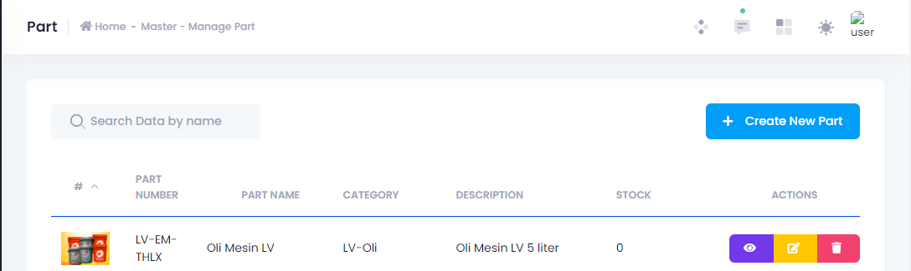

Pada umumnya, menambahkan data ke dalam master data dilakukan dengan menekan tombol (+ Create New X) yang terdapat pada bagian kanan atas tabel.

Kemudian, isi data-data yang diperlukan pada field yang muncul.

!!!warning
field bertanda bintang (*) adalah field yang harus diisi (required).
!!!

Jika anda telah mengisi semua data tersebut, tekan (Save) untuk menyimpannya.

