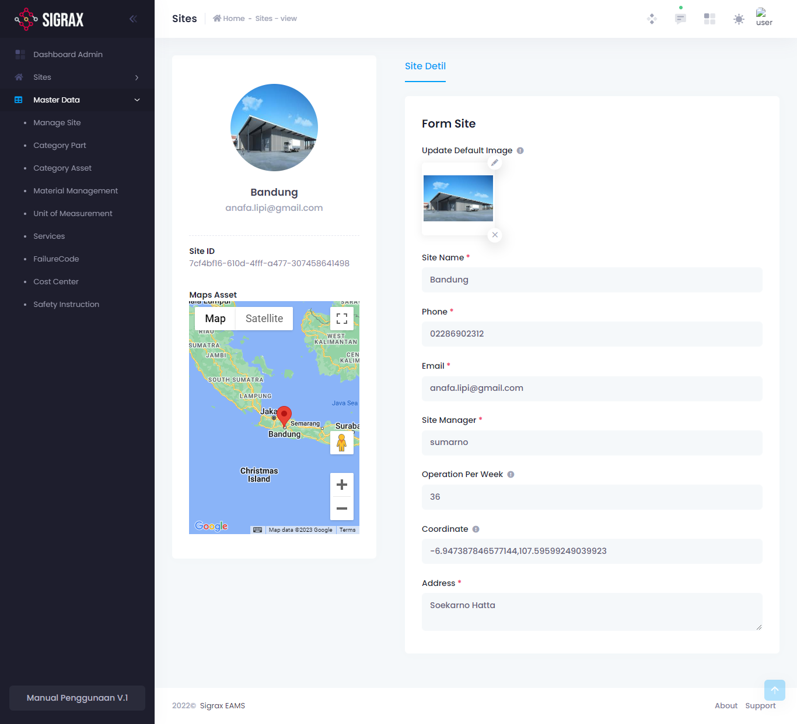
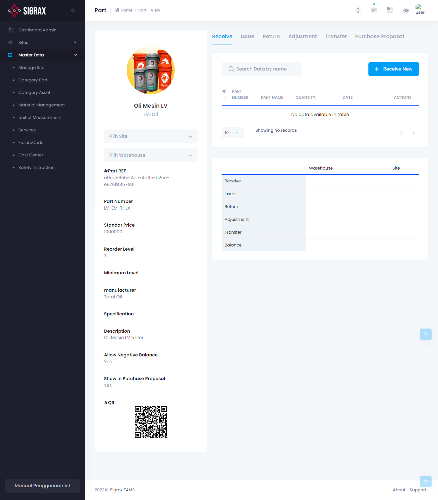

Detail data adalah menu yang digunakan untuk melihat dan mengisi detail dari tiap data yang anda telah masukkan.

!!!
Tidak semua jenis data memiliki menu detail data ini.
!!!

Untuk masuk ke menu detail data, anda dapat menekan tombol yang berlogo mata pada setiap item pada list data anda.

Tampilan dari halaman detail data adalah sebagai berikut:

## Manage Site

Anda dapat mengatur detail site lebih jauh seperti Manajer Site, Operasi per Minggu dan lainnya.

## Material Management

### Receive
Apabila part tersebut diterima atau bertambah, anda dapat melakukannya di tab ini dengan menekan (+ Receive New).

### Issue
Data jumlah part tersebut digunakan.

### Return
Data jumlah part tersebut dikembalikan.

### Adjustment
Data penyesuaian jumlah part.

### Transfer
Data transfer part tersebut beserta kuantitasnya.

### Purchase Proposal
Data Purchase Request part tersebut, **Jika ada**. 

## BOM List

### BOM List Detail
Anda dapat mengedit nama dan deskripsi BOM List yang dipilih.

### Part
Anda dapat mengatur part apa saja yang termasuk dalam BOM List yang dipilih.