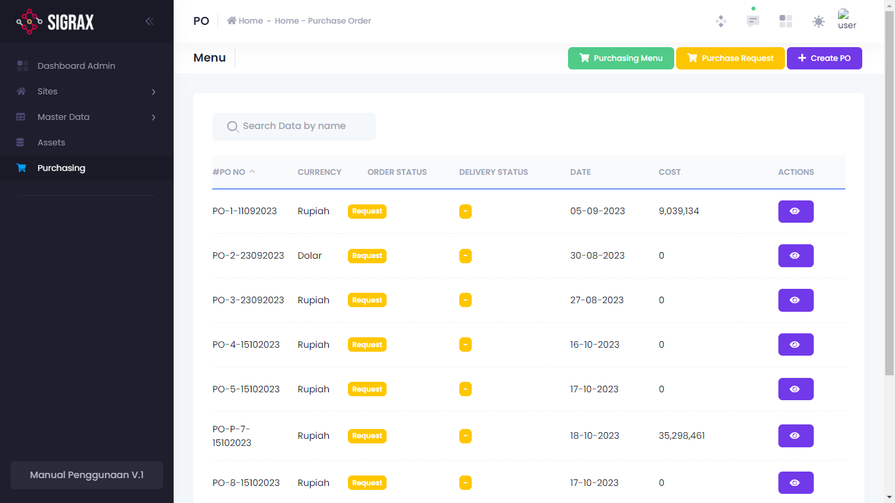
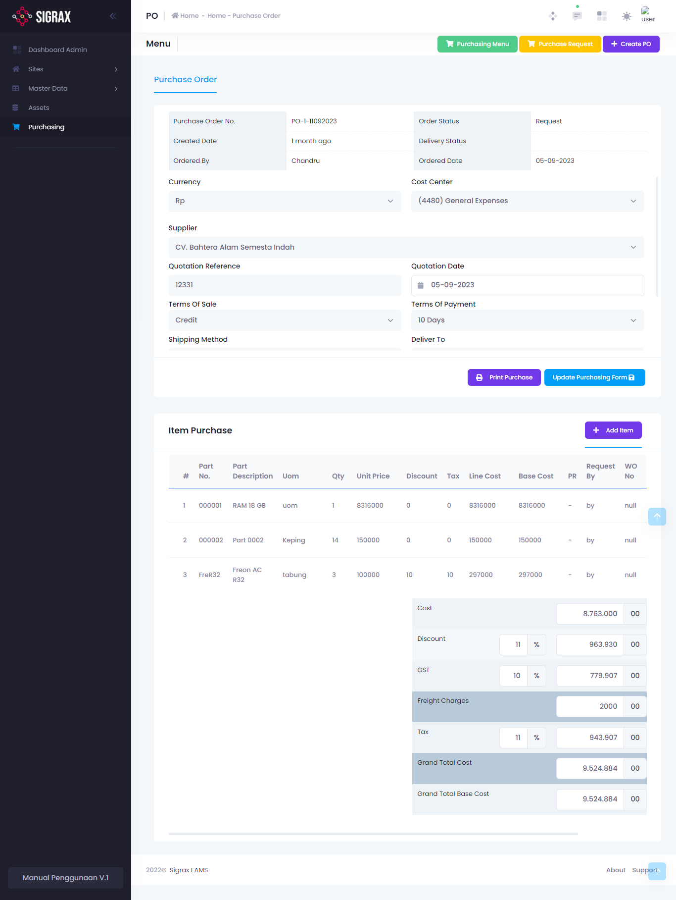

Purchase Order (PO) adalah dokumen atau bukti penting terkait pemesanan barang dari penjual ke pelanggan yang mana produknya akan dikirimkan di waktu yang sudah ditentukan.

!!!
PO dapat dibuat langsung oleh bagian purchasing atau dari PR yang disetujui.
!!!

## Membuat PO

### Pembuatan Melalui PR
Untuk pembuatan PO dari PR yang disetujui, maka PO otomatis terbuat ketika menekan Create PO.

### Pembuatan Langsung
Untuk pembuatan PO secara langsung, tekan tombol (+ Create PO) dan isi form yang muncul.

Field | Makna
--- | ---
Ordered By* | PO dibuat oleh
Date Ordered | Tanggal pemesanan
Currency | Mata uang
Cost Center | Kategori biaya barang
Supplier | Penyuplai/Penjual
Quotation Reference | ~
Quotation Date | ~
Terms of Sale | Cara pembayaran
Shipping Method | Metode pengiriman
Deliver to | Kepada siapa barang akan dikirim
Remakrs | Catatan

!!!
Field yang bertanda (*) adalah field yang harus diisi (Required).
!!!

## Mengatur PO
Setelah PO dibuat, maka PO tersebut akan muncul di list PO. Untuk mengatur PO, tekan tombol action yang terdapat pada tiap PO. (tombol ikon mata).

### Mengedit PO
Untuk merubah detail PO, anda dapat langsung melakukannya pada form yang ada. Tekan (Update Purchasing Form) untuk menyimpannya.

### Menambahkan Item
Untuk menambahkan item yang dibutuhkan pada PO ini, anda dapat menekan tombol (+ Add Item) dan mengisi form yang muncul.

### Menghapus Item
Untuk menghapus item dari daftar item yang dibutuhkan, tekan tombol hapus (ikon tempat sampah) pada list item tersebut yang terdapat pada pojok kanan list.

### Mencetak PO
Untuk mencetak dokumen PO ini, anda dapat menekan tombol (Print Purchase) yang ada.

