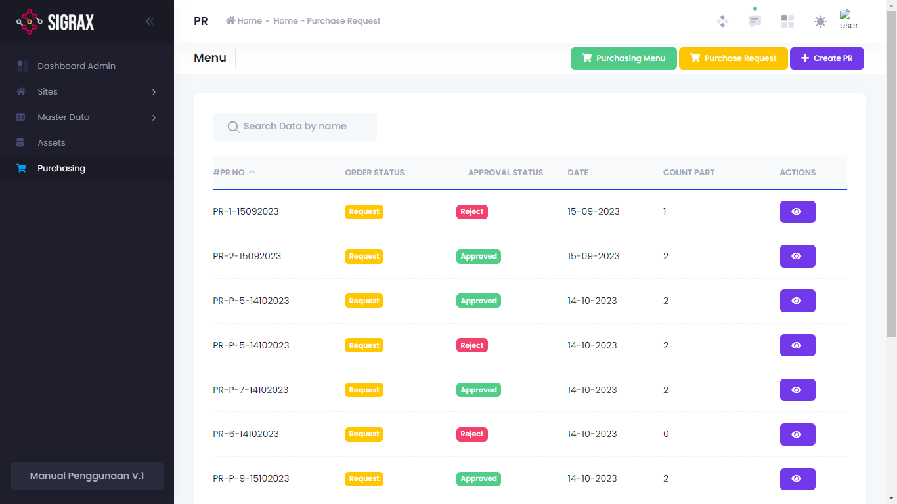
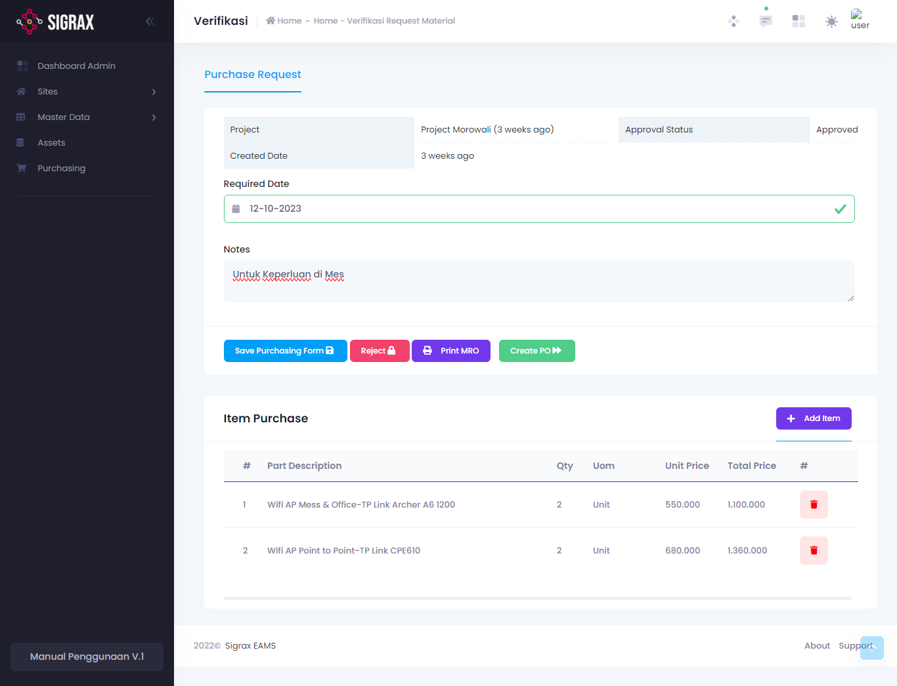

Purchase Request atau Purchase Requisition (PR) adalah  sarana atau lembar permintaan pembelian, yang ditujukan untuk bagian purchasing supaya dapat dilakukan proses pembelian barang yang dibutuhkan, dan dijadikan Purchase Order (PO).

## Menambahkan PR
Untuk menambahkan PR, tekan tombol (+ Create PR) dan isi form yang muncul.

Field | Makna
--- | ---
Created By* | PR dibuat oleh
Requested By* | PR diajukan oleh
Required Date | Tanggal dibutuhkan
Notes | Remark lainnya

!!!
Field yang bertanda (*) adalah field yang harus diisi (Required).
!!!

Tekan tombol save untuk menyimpannya.

## Mengatur PR
Pada setiap PR, terdapat tombol action (simbol mata) yang jika ditekan akan memunculkan detail PR tersebut.

### Mengedit PR
Untuk merubah detail PR yaitu tanggal dan notes dari PR tersebut, anda dapat melakukannya disini, dan simpan (Save Purchasing Form) jika telah selesai.

### Menambahkan Item
Untuk menambahkan item yang dibutuhkan pada PR ini, anda dapat menekan tombol (+ Add Item) dan mengisi form yang muncul.

### Menghapus Item
Untuk menghapus item dari daftar item yang dibutuhkan, tekan tombol hapus (ikon tempat sampah) pada list item tersebut.

### Mencetak PR
Untuk mencetak dokumen PR ini, anda dapat menekan tombol (Print MRO) yang ada.

### Tindak Lanjut PR

==- Menolak PR
Jika PR tidak disetujui, maka tekan (Reject) untuk menolak PR tersebut.
===

==- Menyetujui PR / Buat PO
Jika PR disetujui, maka tekan (Create PO) untuk membuat PO dari PR tersebut.
===
