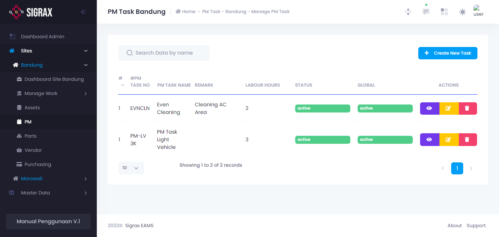
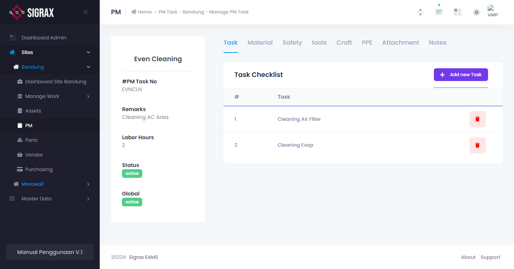
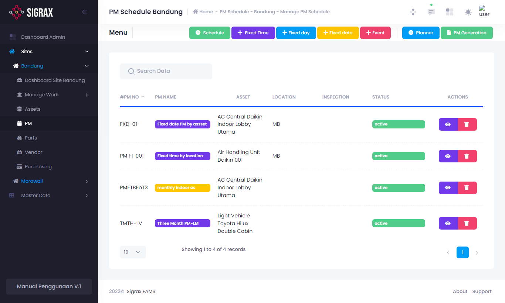
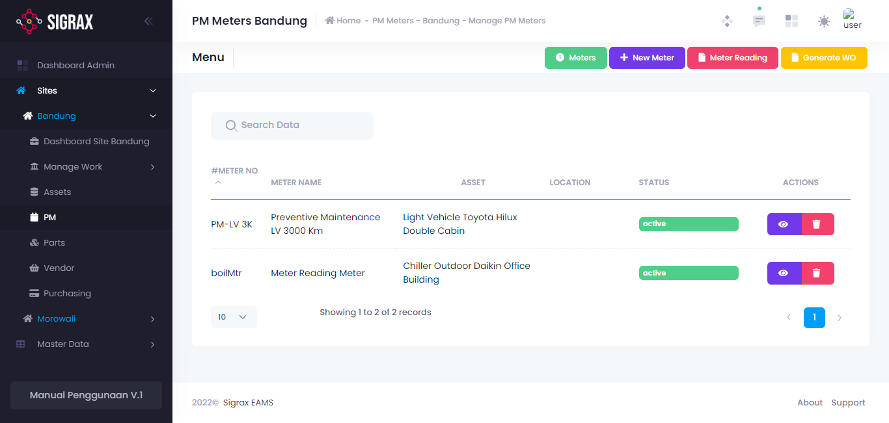
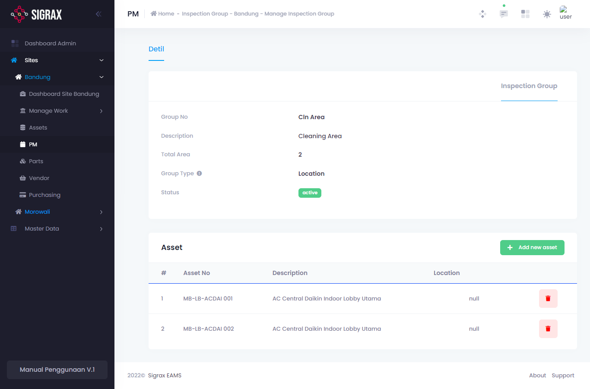

Preventive Maintenance adalah serangkaian kegiatan perawatan yang direncanakan dan dilakukan secara berkala untuk mencegah kerusakan atau kegagalan suatu aset atau part. Pada halaman ini, anda dapat mengatur dan menjadwalkan PM yang akan dilakukan.

## PM Tasks

PM Task adalah inti dan hal yang paling utama dari PM itu sendiri. PM task menjabarkan pekerjaan yang harus dilakukan pada suatu PM. Halaman ini akan menampilkan semua task yang telah dibuat.

### Menambahkan PM Tasks
Untuk menambahkan task, anda dapat menekan tombol (Create New Task) dan mengisi form yang muncul.

Field | Makna
--- | ---
PM Task No* | Nomor ID task
PM Task Name* | Nama task
Remark | ~
Labour Hours |  Jam kerja yang dibutuhkan untuk PM
Status | Apakah task aktif atau tidak.
Global | ~

Ketika grup telah dibuat, selanjutnya anda dapat mengatur detail dalam task tersebut, termasuk task checklist, part yang dibutuhkan, instruksi dan lain-lain. Untuk melakukan hal tersebut, anda dapat menekan tombol lihat, yaitu:

Kemudian, anda akan diarahkan ke halaman isi dari task tersebut yang memiliki beberapa submenu, yaitu:

#### Task
Task adalah pekerjaan dari PM itu sendiri. Task ini terdiri dari check list pekerjaan atau tindakan apa saja yang dilakukan pada suatu PM. Pada halaman ini, anda dapat melihat dan mengatur task list tersebut. Untuk menambah pekerjaan, anda dapat menekan tombol (Add New Task) yang berada pada atas halaman dan mengisi form yang muncul.

#### Material
Material atau part adalah suku cadang yang dibutuhkan dalam pengerjaan PM. Pada submenu ini anda dapat melihat dan mengatur material yang diperlukan. Anda dapat menambahkan material berdasarkan data material yang ada pada [master data](/master-data) pada field yang tersedia. Anda juga dapat mengatur berapa kuantitas yang dibutuhkan.

#### Safety
Safety Instruction adalah instruksi keselamatan yang harus dipatuhi selama pengerjaan PM. Pada submenu ini anda dapat melihat dan mengatur instruksi yang diperlukan. Anda dapat menambahkan craft berdasarkan data **safety instruction** yang ada pada [master data](/master-data) pada field yang tersedia. Jangan lupa simpan perubahan yang anda lakukan.

#### Tools
Tools adalah alat-alat yang mungkin diperlukan selama pengerjaan PM. Anda dapat menambahkan nama tools pada field yang tersedia, dan jumlah alat tersebut. 

#### Craft
Craft adalah jenis pekerjaan yang dibutuhkan dalam pengerjaan PM, seperti kelistrikan, mekanis dan lain-lain. Pada submenu ini anda dapat mengatur craft yang dibutuhkan. Anda dapat menambahkan craft berdasarkan **craft** yang ada pada [master data](/master-data) pada field yang tersedia.

#### PPE
Personal Protective Equipment (PPE) adalah peralatan atau perlengkapan yang dirancang untuk melindungi kesehatan dan keselamatan individu selama pengerjaan PM. Pada submenu ini anda dapat melihat dan mengatur PPE yang dibutuhkan. Anda dapat menambahkan PPE dengan memasukkan nama PPE tersebut dan menyimpannya.

#### Attachments
Attachment atau lampiran adalah dokumen yang mungkin diperlukan dalam pengerjaan PM. Anda dapat menambahkan dan mengunggah lampiran dengan menekan tombol (Upload Attachment) yang berada pada atas halaman.

#### Notes
Notes adalah catatan lainnya yang mungkin diperlukan dalam pengerjaan PM. Jangan lupa simpan perubahan yang anda lakukan.

### Mengedit PM Tasks
Untuk mengedit sebuah task itu sendiri, anda dapat menekan tombol edit yang terdapat pada list, dan anda akan dimunculkan pop-up task tersebut dan anda dapat mengubahnya. Tekan tombol (Save) untuk menyimpan perubahan yang dilakukan.

### Menghapus PM Tasks
Untuk mengedit sebuah task itu sendiri, anda dapat menekan tombol hapus yang bersimbolkan tempat sampah berwarna merah.

## PM Schedules (Time-Based)

PM Time-Based berarti penjadwalan pemeliharaan berdasarkan waktu yang ditentukan. Pada halaman utama atau halaman schedules ini, anda dapat melihat daftar pemeliharaan berkala yang dibuat berdasarkan waktu tertentu. Anda dapat menambahkan PM berdasarkan waktu ini dengan

Jenis | Jangka Waktu
--- | ---
Fixed Time | Adalah berdasarkan jangka waktu tertentu, yang dapat anda pilih antara harian (1 Hari) mingguan (7 Hari), bulanan (28 Hari), 2 bulanan (56 Hari) dan Tahunan (365 Hari).
Fixed Day | Fixed Day artinya adalah berdasarkan hari tertentu per bulan. Misalkan anda mengatur PM akan dilakukan pada hari Rabu minggu ke 2 dan dilaksanakan 3 bulan sekali.
Fixed Date | Fixed Date artinya adalah berdasarkan tanggal tertentu. Misal anda ingin mengatur PM akan dilaksanakan tanggal 10 Tiap bulan atau 2 bulan.
Event | Event adalah berdasarkan suatu kejadian atau kegiatan tertentu.

Untuk menjadwalkan PM Time-based sendiri, anda dapat menekan salah satu dari tombol diatas berdasarkan yang anda inginkan, kemudian anda akan diarahkan ke form dengan data sebagai berikut:

Field | Makna
--- | ---
PM No* | Nomor ID PM
PM Name | Nama PM
Work Trade | Jenis pekerjaan yang dilakukan
Choose PM By | Pilihan objek yang akan dilakukan maintenance. Dapat berupa satu aset, satu lokasi (semua aset dalam lokasi) dan inspection group (jenis/grup aset (lihat [Group Inspection](#group-inspection)))
Asset/Location/Inspection Group | Nama aset/lokasi/grup yang akan dilakukan PM
Task No | Pekerjaan yang akan dilakukan. (lihat [PM Task](##pm-tasks))
Generation Type | Waktu dimana PM akan meng-generate WO.
Time Setting | Pengaturan waktu. Field ini berbeda tergantung pada kategori rentang waktu yang anda pilih.
Status | Apakah PM aktif atau tidak.

Untuk mengedit sebuah PM, anda dapat menekan tombol edit yang terdapat pada setiap list PM.

Dengan menekan tombol tersebut, anda akan diarahkan ke halaman detail PM tersebut dan dapat mengubahnya. Dalam menu edit tersebut, juga terdapat tombol forecast, yang akan menampilkan jadwal PM ke depannya.

## PM Schedules (Meter-Based)

PM Meter-Based berarti penjadwalan pemeliharaan berdasarkan meter atau ukuran yang dapat diukur. Pada halaman utama atau halaman meters ini, anda dapat melihat daftar pemeliharaan berkala yang dibuat berdasarkan waktu tertentu. Anda dapat menambahkan PM berdasarkan meter ini dengan menekan tombol (New Meter) yang kemudian anda akan diarahkan ke form dengan data sebagai berikut:

Field | Makna
--- | ---
Meter No* | Nomor ID Meter
Meter Name | Nama Meter
Work Trade | Jenis pekerjaan yang dilakukan
Asset | Aset yang akan dilakukan PM
Meter Reading | Jenis pembacaan meter. Incremental: perulangan, misal setiap 100 km, dan Threshold : ambang batas, misal jika meter telah menyentuh 5000 km.
Unit of Measurement | Satuan ukuran
Status | Apakah PM aktif atau tidak.

Kemudian, untuk memperbarui meter yang ada, anda dapat menekan tombol [meter reading](#meter-reading), yang akan membawa anda ke halaman tempat meter tersebut berada.

Untuk mengedit sebuah PM, anda dapat menekan tombol edit yang terdapat pada setiap list PM.

Dengan menekan tombol tersebut, anda akan diarahkan ke halaman detail PM tersebut dan dapat mengubahnya.

## Meter Reading
Meter reading, seperti telah dijelaskan pada [PM Schedules (Meter Based)](#pm-schedules-meter-based), adalah halaman untuk memperbarui (update) dari PM-PM berdasarkan meter yang telah anda buat.

## PM Generation
Halaman ini adalah halaman dimana anda dapat melihat keseluruhan PM yang dibuat, waktu dimana PM tersebut harus dilakukan dan juga waktu aktual pengerjaan PM tersebut.

## PM Planner
Halaman planner adalah halaman yang berisikan kalender, yang mana di dalamnya terdapat pengingat untuk PM-PM yang ada.

## Group Inspection
Grup inspeksi adalah satu grup yang berisi aset-aset atau lokasi yang akan diservis/ maintenance pada waktu yang sama. Aset atau lokasi dapat berada pada satu site yang sama ataupun tidak. Halaman ini akan menampilkan grup-grup yang telah dibuat.
Untuk menambahkan grup, anda dapat menekan tombol (Create New Group) dan mengisi form yang muncul.

Field | Makna
--- | ---
Group No* | Nomor ID grup
Group Description* | Deskripsi grup. Contoh : Cleaning area, AC Ruang A.
Group Type | Tipe grup, yaitu antara aset atau lokasi.
Total Area | Jumlah luas area
Status | Apakah grup aktif atau tidak.

Ketika grup telah dibuat, selanjutnya anda dapat menambahkan aset yang akan menjadi bagian dari grup tersebut.

Untuk melakukan hal tersebut, anda dapat menekan tombol lihat grup, yaitu tombol pertama yang bersimbolkan mata, dan akan membawa anda ke halaman isi dari grup tersebut.

Untuk menambahkan aset, anda dapat menekan tombol (Add new asset), dan memilih aset dari aset-aset yang sudah ada. Jangan lupa untuk menekan (Save) untuk menyimpannya.

Untuk mengedit sebuah grup, anda dapat menekan tombol edit yang terdapat pada list, yaitu tombol dengan simbol pena yang berada di tengah. Dengan menekan tombol tersebut, anda akan diarahkan ke halaman detail grup tersebut dan anda dapat mengubahnya. Tekan tombol (Save) untuk menyimpan perubahan yang dilakukan.

