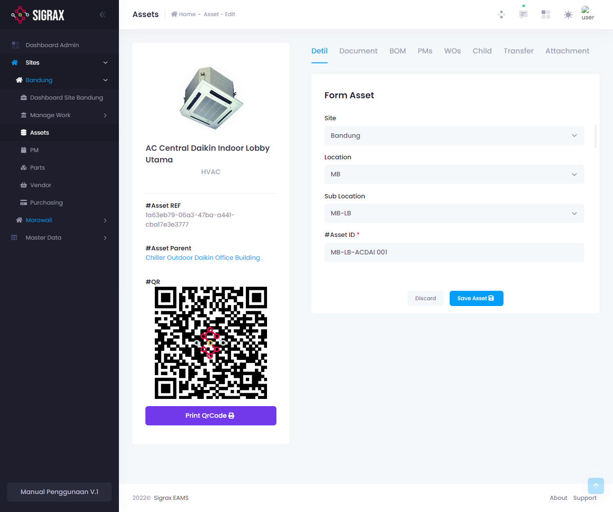
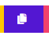

Menu Assets disini adalah dimana anda dapat melihat dan mengatur aset-aset yang terdapat pada suatu site.

## Menambahkan Aset

Untuk menambahkan aset, anda dapat menekan tombol menekan tombol (+ Create New Asset) di pojok kanan atas tabel dan mengisi form yang muncul.

Field  | Makna
---    | ---
Location | Lokasi dimana aset berada.
Sublocation | Sub-lokasi dimana aset berada.
Asset ID* | Nomor ID aset.
Asset Name* | Nama aset.
Value | Nilai aset saat ini.
Purchase Price | Harga beli aset.
Hour Meter | ~
Manufacturer | Pembuat aset
Description | Deskripsi mengenai aset.
Operating Manual | Dokumen mengenai manual operasi aset.
Service Manual | Dokumen mengenai servis aset.
Attachment | Dokumen lainnya yang berkaitan dengan aset.

!!!warning
field bertanda bintang (*) adalah field yang harus diisi (required).
!!!

Jika anda sudah mengisi semua data tersebut, anda dapat menekan tombol (Save Asset) dan pembuatan aset selesai.

## Melihat Detail dan Mengedit Aset
Untuk melihat dan mengedit aset,  anda dapat menekan tombol edit yang terdapat pada setiap aset.

Setelah anda menekan tombol tersebut, anda akan dibawa ke halaman detail aset tersebut, yang mana mempunyai tampilan sebagai berikut.

Dapat dilihat bahwa dalam aset tersebut terdapat beberapa halaman

### Detail
Detail pada aset tersebut dapat dilihat disini. Selain dapat melihat keseluruhan detail dari sebuah aset, anda juga dapat mengubahnya. Namun, jangan lupa untuk menekan tombol (Save Asset) pada bagian bawah form detail untuk menyimpan perubahan yang dilakukan. Pada detail ini juga terdapat beberapa field yang anda dapat isi yang mana tidak ada pada saat anda menambahkan aset tersebut.

### Dokumen
Document adalah dokumen kelengkapan yang menyertai aset tersebut, seperti operating manual dan service manual yang di upload ketika menambahkan aset tersebut.

### BOM
Bill of Material adalah material atau suku cadang yang diperlukan aset tersebut, khususnya yang diperlukan untuk perbaikan atau pemeliharaan. Anda dapat memilih BOM List ini berdasarkan BOM List yang anda tambahkan pada **master data**.

### PMs
Preventive Maintenance atau pemeliharaan adalah pengamatan secara berkala untuk memastikan aset tersebut akan terus berfungsi dengan baik. Pada halaman ini anda dapat melihat PM yang telah dilakukan pada aset yang sedang anda lihat.

### WOs
WO atau work order adalah pengerjaan perbaikan yang dikerjakan pada suatu aset. Pada halaman ini anda dapat melihat daftar WO yang telah dikerjakan pada aset  yang sedang anda lihat.

### Child
Child pada aset bermakna aset yang terdapat dalam, menjadi bagian dari, atau memiliki keterkaitan dengan suatu aset yang lain. Misalnya anda memiliki sebuah aset sebuah AC, maka child dari aset AC tersebut adalah AC indoor sedangkan parent nya adalah AC outdoor. Pada halaman ini, anda dapat menambahkan child dari aset yang sedang anda lihat. Untuk menambahkan child, anda dapat menekan tombol (Choose Child) di bagian atas, dan memilih aset mana yang akan anda jadikan child dari aset yang sedang anda lihat.

### Transfer
Transfer adalah perpindahan aset dari satu lokasi ke lokasi lainnya, jika anda memiliki lebih dari 1 lokasi. Pada halaman ini, anda dapat melihat history pemindahan aset yang sedang anda lihat, seperti dari, ke mana dan kapan aset ini dipindahkan. Anda juga dapat memindahkan aset yang sedang anda pilih ke lokasi lain.

### Attachment
Attachment atau lampiran adalah dokumen lainnya yang sekiranya diperlukan untuk menyertai aset ini. Anda dapat menambahkan lampiran ini dengan menekan tombol (+ Upload Attachment), kemudian mengisi nama dan mengunggah dokumen lampiran, dan menekan tombol simpan. Jika anda telah memiliki lampiran, anda juga dapat melihatnya di halaman ini.

## Transfer Aset

Untuk mentransfer atau memindahkan aset anda pada suatu lokasi ke suatu lokasi lain. Untuk melakukan hal tersebut, pergi ke tab transfer pada suatu aset dan tekan (+ Transfer Asset), dan isi lokasi tujuan pada form yang muncul.
!!!warning
field bertanda bintang (*) adalah field yang harus diisi (required).
!!!

## Menyalin Aset

Untuk menyalin atau menduplikat aset, anda cukup menekan tombol copy di samping tombol edit, yaitu:

Lalu, anda akan dialihkan ke halaman tambah aset, namun dengan data yang sudah ada, yaitu data aset yang anda pilih dan ingin disalin. Jika anda ingin merubah beberapa detail dari aset salinan tersebut anda dapat melakukannya disini. Jangan lupa untuk menekan tombol (Save Copy Asset) ketika selesai, dan aset salinan akan disimpan

!!!
Harap diingat bahwa ID aset harus diganti, karena ID pada tiap aset bersifat unik.
!!!

## Menghapus Aset

Untuk menghapus lokasi, pada list lokasi tersebut anda dapat menekan tombol merah ikon tempat sampah yang ada di sebelah tombol salin.