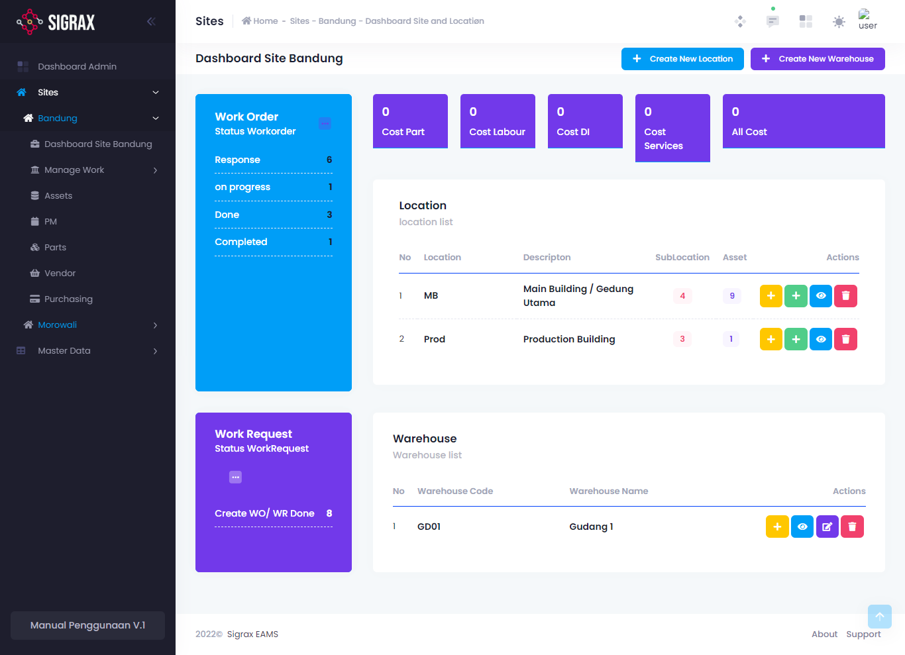
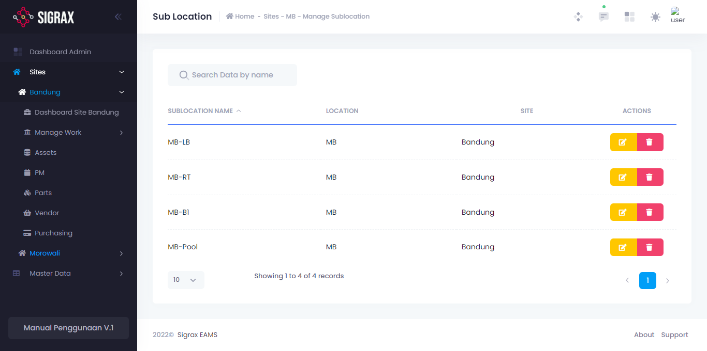
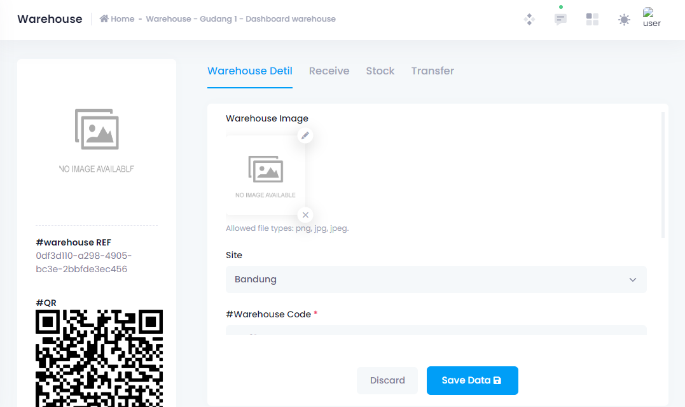
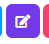

Site adalah tempat dimana aset-aset perusahaan berada. Pada halaman ini, anda dapat melihat keseluruhan detail dan data dari lokasi yang terdaftar pada master data. Pada satu site, terdapat tampilan dashboard sebagai berikut:

Dalam halaman utama ini, terdapat beberapa hal yang terlihat, yaitu:

## Highlights
## Highlights

### Work Request Highlight
### Work Request Highlight
Pada highlight ini, ditampilkan data WR yang telah selesai dan dijadikan WO. Anda juga dapat langsung membuat WR dengan menekan tombol titik tiga di pojok kanan kotak (...) dan tekan new WR. Untuk lebih lengkap mengenai Work Request, lihat pada bagian [Manage Works](/sites/manage-works). 

### Work Order Highlight
### Work Order Highlight
Pada highlight ini, ditampilkan data WO yang harus dilihat, sedang berjalan, selesai dan lain-lain. Anda juga dapat langsung membuat WO dengan menekan tombol titik tiga di pojok kanan kotak (...) dan tekan new WO. Untuk lebih lengkap mengenai Work Order, lihat pada bagian [Manage Works](/sites/manage-works). 

### Cost Highlight
Costs atau biaya adalah jumlah biaya-biaya yang anda telah dikeluarkan selama satu jangka waktu. Pada halaman ini terdapat beberapa highlight biaya, seperti seperti biaya part (suku cadang), labour (tenaga kerja), dan lain-lain.

## Location
## Location
Lokasi adalah tempat dimana aset anda berada. Berbeda dengan sites, lokasi adalah tempat spesifik dalam site tersebut, atau satu tingkat di bawahnya. Contoh : Didalam site Jakarta, terdapat lokasi Main Building dan R&D Building, atau Lantai 1 dan Lantai 2. Didalam suatu site dapat terdapat beberapa lokasi.

### Menambah Lokasi
Tekan tombol **(+ Create New Location)**
yang berada pada sisi atas dashboard, dan isi form yang muncul.

!!!warning Alert
Pada tiap form, field bertanda bintang (*) adalah field yang harus diisi (required).
!!!

### Mengedit Lokasi
Tekan tombol edit yang bersimbolkan mata berwarna biru pada list lokasi.
Kemudian akan muncul nama dan deskripsi dari lokasi tersebut dan anda dapat mengubahnya.

### Menghapus Lokasi
==- Tekan tombol hapus.
(ikon tempat sampah yang ada di sebelah tombol edit).
===

## Sub-Location
Sub-lokasi adalah tempat dimana aset anda berada, namun bersifat lebih spesifik lagi daripada lokasi. Misal dalam satu lokasi terdapat ruang rapat dan ruang kerja, maka ruang tersebut dapat disebut sebagai sub-lokasi. Didalam satu lokasi juga dapat terdapat beberapa sub-lokasi.

### Menambah Sub-Lokasi
Untuk menambah sub lokasi pada sebuah lokasi, tekan tombol plus berwarna hijau yang ada pada tiap lokasi dan isi form yang muncul.

### Mengedit Sub-Lokasi
Tekan angka jumlah sub-lokasi dari lokasi tersebut.

Kemudian akan muncul halaman list sub-lokasi dari lokasi yang anda pilih, yang mana adalah sebagai berikut:

Untuk mengeditnya, anda dapat menekan tombol edit dimana kemudian akan muncul nama dan deskripsi sub lokasi tersebut, dan anda dapat mengubahnya. Jangan lupa tekan (Save Sublocation) untuk menyimpan perubahan yang dilakukan.

### Menghapus Sub-Lokasi
Untuk menghapus sub-lokasi, pada list lokasi tersebut anda dapat menekan tombol merah ikon tempat sampah yang ada di sebelah tombol edit.

## Warehouse
Berbeda dengan lokasi dan sub-lokasi, warehouse atau gudang adalah tempat dimana part atau suku cadang anda berada, namun masih dalam satu site yang sama.

### Menambah Gudang
Untuk menambahkan gudang pada suatu site, anda dapat menekan tombol (+ Create New Warehouse) yang berada pada sisi atas dashboard dan mengisi form yang muncul.

### Mengisi dan Melihat Detail Gudang
Pada list warehouse yang terdapat dibawah list lokasi, anda dapat menekan tombol detail yang bersimbolkan mata berwarna biru.

Kemudian anda akan dibawa ke halaman detail gudang tersebut. Pada halaman ini, anda juga dapat mengubah detail gudang.

Pada halaman detail gudang, terdapat juga sub-menu yang berguna untuk mengatur gudang tersebut, yaitu:

==- Warehouse Detail
Warehouse detail adalah data tentang gudang itu sendiri.
Pada halaman ini anda dapat melihat detail seperti foto, nama, kode dan deskripsi dari gudang tersebut dan merubahnya.
===

==- Receive
Halaman receive ini adalah halaman dimana anda dapat mengatur dan menambahkan barang/part yang masuk ke suatu gudang.
===

==- Stock
Halaman stock adalah halaman dimana anda dapat melihat dan mengatur stok suku cadang/part yang terdapat pada suatu gudang.
===

==- Transfer
Pada halaman transfer disini, anda dapat melihat data suku cadang/part yang berpindah (transfer) baik menuju maupun dari gudang tersebut.
===

### Mengedit Gudang
Untuk mengedit gudang, anda dapat menekan tombol edit yang bersimbolkan pensil.

kemudian akan muncul kode, nama dan deskripsi dari lokasi tersebut dan anda dapat mengubahnya.

### Menghapus Gudang
Untuk menghapus lokasi, anda dapat menekan tombol merah ikon tempat sampah yang ada di sebelah tombol edit.
