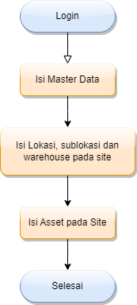

Hal pertama yang harus dilakukan setelah anda masuk ke dalam sistem CMMS untuk pertama kali adalah mengisi data-data yang diperlukan.

## 1. Master Data

Master data adalah kumpulan data-data yang akan berguna saat penggunaan CMMS ini. Pada modul master data, terdapat banyak data yang harus anda isi, yaitu:

Data | Harus Diisi Pada Awal Penggunaan
--- | ---
Manage Site | Ya
Category Part | Ya
Category Asset | Ya
Material Management | Ya
Unit of Measurement | Ya
Services | -
Failure Code | -
Cost Center | -
Safety Instruction | -
Work Priority | -
Job Plan | -
Work Type | -
Status | -
BOM List | -
Employee | -
Vendor & Supplier | -
Currency | -
Craft | -
Work Trade/Tag | -

!!!
Untuk mengetahui apa saja data tersebut, silahkan baca [Data Types](/master-data/data-types).
!!!

## 2. Location, Sublocation and Warehouse
Setelah anda mengisi master data dengan data-data yang dibutuhkan, selanjutnya anda dapat mengisi lokasi, sub-lokasi dan gudang yang anda miliki pada setiap site anda
Site sendiri  adalah tempat dimana aset-aset perusahaan berada, Lokasi adalah tempat atau bagian dalam site tersebut, dan sub-lokasi bersifat lebih spesifik lagi.

!!!
Untuk mengisi data-data tersebut, silahkan baca [Site Dashboard](/sites/site-dashboard).
!!!

## 3. Aset
Ketika anda telah menyempurnakan data pada master data dan juga lokasi, Anda dapat menambahkan aset anda di modul tiap site, lebih tepatnya pada menu Assets. pada halaman itu juga, anda dapat melihat, mengedit, dan menghapus aset-aset yang anda miliki di site tersebut.

!!!
Untuk lebih lengkap mengenai bagaimana cara menambahkan, mengedit dan menghapus aset, anda juga dapat melihat [Site Assets](/sites/site-assets).
!!!

## Flowchart Pengisian Data
Ringkasnya, untuk flow pengisian data adalah sebagai berikut:

