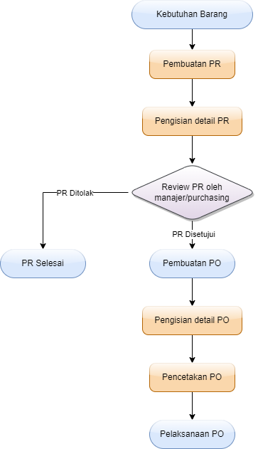

Untuk membuat suatu purchasing, alur dari hal tersebut adalah sebagai berikut.

!!!warning Perhatian
Perhatikan bahwa alur ini adalah pembuatan PO dari PR. untuk pembuatan PO secara langsung, maka anda dapat langsung melakukannya dari langkah kelima/Pembuatan PO.
!!!

## 1. Membuat Purchase Request
Untuk pembuatan PR, siapapun dapat melakukannya. Untuk membuat PR tersebut, lihat d di [sini](/purchasing/purchase-request/#menambahkan-pr).

## 2. Pengisian Detail PR dan Barang
Ketika PR telah dibuat, maka anda dapat mengisi detail lebih jauh, dan yang lebih penting lagi adalah **mengisi daftar barang yang ingin dibeli**. Untuk mengisi barang, dapat anda isi satu per satu atau berdasarkan Purchase Proposal yang ada.

!!!
Dalam pengisian detail ini, anda juga harus mengisi Work Order dimana barang ini dibutuhkan.
!!!

## 3. Review PR
Setelah PR dibuat, maka PR tersebut direview terlebih dahulu oleh manager atau bagian purchasing, yang mana akan menentukan apakah PR tersebut memang diperlukan atau tidak.

Review ini dapat berupa pengecekan stok barang, pengecekan harga barang dan lainnya.

## 4. Hasil Review PR
=== Jika PR dirasa tidak diperlukan
Maka akan ditolak dan tidak ada tindak lanjut lagi.
===

=== Jika PR dirasa memang diperlukan
Maka PR tersebut akan dijadikan PO.
===

## 5. Pembuatan PO
=== Jika PO dibuat dari PR
maka langkah ini tidak diperlukan.
===

=== Jika PO dibuat langsung
PO hanya dapat dibuat langsung oleh bagian purchasing. Untuk membuat PO secara langsung tersebut, lihat d di [sini](/purchasing/purchase-order/#pembuatan-langsung).
===

## 6. Pengisian Detail PO
Ketika PO telah dibuat, maka anda dapat mengisi detail PO tersebut lebih jauh. Untuk PO langsung, anda dapat mengisi daftar barang yang ingin dibeli.

## 7. Pelaksanaan PO
Jika telah selesai mengisi detail PO, anda dapat mencetak PO tersebut dan melaksanakannya sesuai detail dari PO.

## Flowchart Purchasing
