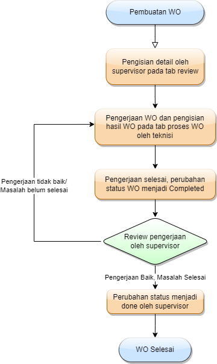

Untuk pembuatan Work Order dapat dilakukan dengan berbagai cara, yaitu dari tindak lanjut Work Request, pembuatan langsung dan melalui Preventive Maintenance. Namun, pada dasarnya alur dari WO adalah sebagai berikut:

## 1. Membuat Work Order
* Untuk WO dari tindak lanjut WR, maka form langsung muncul setelah mengubah status WR menjadi Create WR.
* Untuk WO secara langsung, dapat dibuat melalui dashboard Site.
* Untuk WO dari PM, maka dapat dibuat dari halaman PM.

## 2. Pengisian Detail oleh Supervisor
Setelah WO dibuat, maka supervisor selanjutnya harus mengisi detail WO pada bagian Manage Works > Open Task > Work Order > Tanda edit (Pena) pada WO tersebut dan kemudian isi detail yang dibutuhkan.

## 3. Pengerjaan oleh Teknisi
Setelah pengisian detail WO, maka teknisi yang ditunjuk harus segera melakukan tugasnya. Kemudian, jika telah mengerjakan maka dapat mengubah status menjadi status yang sesuai (waiting for sparepart, on progress,...). Jika memang telah selesai, maka dapat mengubah status WO menjadi completed.

## 4. Review Pekerjaan oleh Supervisor
Ketika status WO telah menjadi completed, maka pekerjaan yang telah dilakukan dapat direview kembali oleh supervisor untuk memastikan pekerjaan yang dilakukan telah sesuai.

## 5. Penyelesaian WO
Jika WO dirasa telah sesuai, maka supervisor dapat merubah status WO menjadi done, dan jika disimpan, maka WO tersebut akan dianggap selesai dan ditutup.

## Flowchart Work Order
