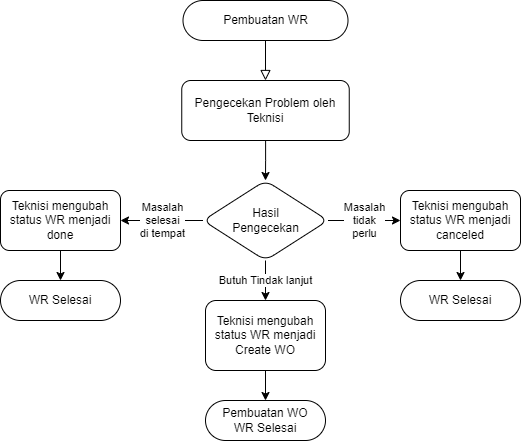

Work Request (WR), seperti yang anda tahu, adalah permintaan/request untuk perbaikan pada suatu aset. Alur kerja pada WR adalah sebagai berikut:

## 1. Membuat Work Request
Siapapun dapat membuat work request. Maka dari itu, form pembuatan WR sendiri tidak terlalu spesifik.

## 2. Asesmen Isu
Setelah WR dibuat, maka seorang teknisi harus mengecek dari laporan tersebut.

## 3. Hasil Asesmen
Setelah dievaluasi, maka teknisi harus mengubah hasil WR menjadi salah satu diantara pilihan berikut:
* Done : Masalah ringan dan selesai di tempat, tidak butuh tindak lanjut
* Canceled : Masalah tidak perlu/tidak penting
* Create WO : Masalah perlu ditindaklanjuti dan dibuat WO.

## Flowchart Pembuatan WR

